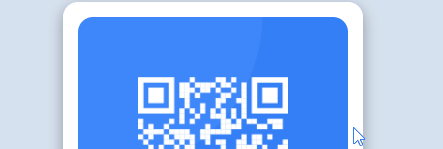

# Frontend Mentor - QR code component solution

This is a solution to the [QR code component challenge on Frontend Mentor](https://www.frontendmentor.io/challenges/qr-code-component-iux_sIO_H). Frontend Mentor challenges help you improve your coding skills by building realistic projects. 

## Table of contents

- [Overview](#overview)
  - [Screenshot](#screenshot)
  - [Links](#links)
- [My process](#my-process)
  - [Built with](#built-with)
  - [What I learned](#what-i-learned)
  - [Continued development](#continued-development)
- [Author](#author)
- [Acknowledgments](#acknowledgments)


## Overview

### Screenshot



### Links

- Solution URL: [https://github.com/Vitor5782/Projeto-3-FrontEndMentor](https://github.com/Vitor5782/Projeto-3-FrontEndMentor)
- Live Site URL: [https://vitor5782.github.io/Projeto-3-FrontEndMentor/](https://vitor5782.github.io/Projeto-3-FrontEndMentor/)

## My process

### Built with

- Semantic HTML5 markup
- CSS custom properties
- Flexbox
- CSS Grid
- Mobile-first workflow
### What I learned

Estou feliz que estou conseguindo melhorar meu responsivo, mas ainda sinto uma dificuldade ao codar ele, mas sei que somente praticando e estudando mais que serei capaz de fazer um bom responsivo.
```css
@media (max-width: 600px) {
    .container-principal {
        margin: 10%;
        width: 80%;
        height: 100%;
        padding-bottom: 10%;
    }
}
```


### Continued development
Tenho que melhorar meu css para um desempenho maior em diferentes telas.

## Author

- Website - [Vitor Hugo Teixeira](https://github.com/vitor5782)
- Frontend Mentor - [@Vitor5782](https://www.frontendmentor.io/profile/Vitor5782)
- Facebook - [@vitorhugoteixeira](https://www.facebook.com/vitor.hugo.3591267/)

## Acknowledgments

Este projeto foi possivel graças a muito treino, e ao curso dos irmaos DEV.<br>
Melhor curso para serum desenvolvedor front-end "DEV QUEST"
